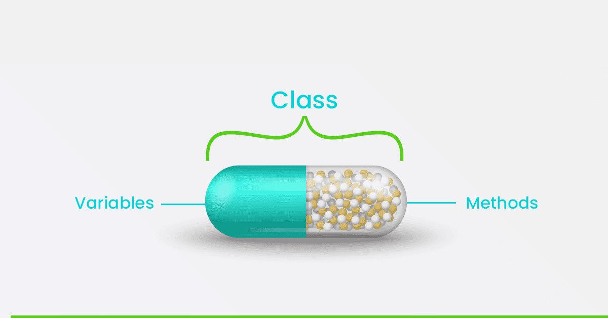

# Java-Part 2

---------------------------------
- packages
- object-oriented programming(oop)
- collection framework
- exception handling
- functional programming
- concurrency & multithreading


<hr/>

## Packages
<hr/>

a mechanism that encapsulates a group of classes, sub-packages, and interfaces.
- Prevent naming conflicts.
- Easier to organize classes and code.


## Object-Oriented Programming(OOP) 

<hr/>


Object-oriented programming (OOP) involves programming using objects.

An object represents an entity in the real world that can be distinctly identified.

**a student, a car, an account, a user and even a car can all be viewed as objects**

Each Object contains
- **properties or attributes or states**
- **functions or behavior or methods**

A **class** is a **template**, **blueprint**, or **contract** that defines what an object’s data fields and methods.
An **Object** is instance of this class.

<hr/>

<hr/>


### How to declare class 

```
class Car {

    // properties or attributes or data members or state
    // methods or functions or procedures
}
```


Properties could be primitive or reference types.<br/>
Method are the normal method.

to initialize the properties we can use **constructors**

### Constructor
<hr/>

A **constructor** is a special method used to **initialize objects** when they are created.

- It has the same name as the class.
- A constructor does not have a return type.
- It is called when an object is instantiated.

```
class Car {
    int speed;
    String name;
    
    Car(int s, String n){
        speed = s;
        name = n;
    }
}
```

### this Keyword
keyword refers to the current instance of the class. 

```
class Person {
    // properties or attributes 
    String name;
    int age;

    // here we can use this keyword
    Person(String name, int age) {
        this.name = name;  // 'this.name' refers to the instance variable, 'name' refers to the parameter
        this.age = age;    // 'this.age' refers to the instance variable, 'age' refers to the parameter
    }
}

```

### Access Modifiers
<hr/>

**keywords** that define the **visibility** and **accessibility** of methods, constructors, and variables.


<hr/>

- **public**  means method, or field is accessible from any other class or package
- **private** the method, field, or constructor is only accessible within the same class.
- If **no access modifier** is specified, it is called **default access**  or package-private and can access method and properties from the same package only.
- **protected** such as default + access them from the subclass

Here’s a simple table that shows the usage of each access modifier in Java:

| **Modifier**   | **Class** | **Package** | **Subclass** | **World** |
|----------------|-----------|-------------|--------------|-----------|
| **`public`**   | Yes       | Yes         | Yes          | Yes       |
| **`protected`**| Yes       | Yes         | Yes          | No        |
| **`default`**  | Yes       | Yes         | No           | No        |
| **`private`**  | Yes       | No          | No           | No        |

<hr/>

<h2 style="font-weight: bold;text-align: center;color: #0b57d0; border-right: 5px solid #5eb807;border-left: 5px solid #f00;">OOP Concepts</h2>
<hr/>


<hr/>

### Encapsulation
<hr/>

Refers to **bundling** the data (attributes) and the methods (functions) that operate on that data into a single unit, known as a **class**.

```
class User{
        String name;
        String email;
        int age;
    
        void printUserInfo(){
            System.out.println(this.name + " " + this.email + " " + this.age);
        }
    
    }
```



**Good encapsulation** to make the **attributes private** which called **data hiding**.

<hr/>

### Inheritance
<hr/>

we use inheritance to  make **code reusability**.

Allowing class which is **child class** to inherit **properties and methods** from another class which is **parent class**. 


```
class Parent {
    protected int age;
}

class Child extends Parent {
    
}

Child child = new Child();
System.out.println(child.age);

```
<hr/>

### Polymorphism
<hr/>

Method **multiple forms**. <br/>
It allows a single method to behave differently based on the context.

- to make **runtime polymorphism we should have inheritance**.
- **base class contains one method and child classes need to write another logic**.


<hr/>

### Abstraction
<hr/>

About hiding the implementation details.

**first we need to talk about abstract class and interface.**

**_Abstract_** class is a class with the following
- **Cannot be instantiated**.
- **Can have abstract methods (methods without implementations)**
- **Can have concrete methods (methods with body)**
- **Can have fields and constructors**
- **Used for inheritance**

```
abstract class Animal {
    abstract void sound();  // Abstract method
    void eat() {
        System.out.println("Animal is eating.");
    }
}

class Dog extends Animal {
    @Override
    void sound() {
        System.out.println("Dog barks");
    }
}

public class Main {
  public static void main(String[] args) {
 //  Animal animal = new Animal(); // This will cause a compile-time error
        
     Animal dog = new Dog(); // this is abstraction form
     dog.sound();  // Output: Dog barks
     dog.eat();    // Output: Animal is eating.
    }
}

```

We can make the abstraction using **interfaces**
```
interface Animal {
    void sound();  // Abstract method
}

class Dog implements Animal {

    @Override
    public void sound() {
    System.out.println("Dog barks");
    }
}
```

**Note** Java supports multi inheritance on interface level
One class could inherit from multible interfaces.


**All reference is to interface and Base class not to the implementation itself.**

`InterfaceName abc = new ClassName();`

`BaseClassName abc = new ChildClassName();`

Base class may be Concrete class or Abstract class.


<hr/>
<hr/>
<hr/>

### Static Keyword
<hr/>

Static properties and methods is related to class itself and for all the objects not to specific object.

- Comes with properties(attributes) & methods


### Final Keyword
<hr/>

meaning constant values.

**final with**
- **local variables meaning that this variable is const**
- **properties meaning that this attributes is const**
- **with methods meaning these methods could not be inherited**
- **classes mean this class could not be inherited form other classes**
<hr/>


### Wrapper Classes
<hr/>

All primitive data types has a wrapper class, we have 8 primitive data types
- byte has **Byte** class.
- short has **Short** class.
- int has **Integer** class.
- long has a **Long** class.
- float has **Float** class.
- double has **Double** class.
- boolean has **Boolean** class.
- char has **Character** class.

```

        int i = 100;
        Integer x = new Integer(100);
        Integer c = 100;
      //c is reference to object and could access methods and properties
```


<hr/>


<h2 style="font-weight: bold;text-align: center;color: #0b57d0; border-right: 5px solid #5eb807;border-left: 5px solid #f00;border-top:5px solid #00f">Collection Framework</h2>
<hr/>

a group of classes and interfaces that provide various types of **data structures** and **algorithms** to store, manipulate, and retrieve data.

It is part of the **java.util package** and simplifies data handling by **providing standard interfaces, classes, and methods for working with collections of objects.**

<hr/>


<hr/>

## Exception Handling

<hr/>


- **Errors** should not be handled.
- **Checked exception** should be handled in the code.
- **None Checked exception** RuntimeException and could not be handled.

we can handle the exception using try catch block

```
    try{
        // code sample
    
    }catch (Exception ex) {
        System.out.println(ex.getMessage());
    }


```


<hr/>


<hr/>


## Functional Programming Paradigm
<hr/>
a programming paradigm that treats computation as the evaluation of mathematical functions.
Passing functions into another functions.


## Concurrency & Multithreading
<hr/>

the ability of a program to perform multiple tasks or operations simultaneously.


<hr/>

### Resources & Tools
<hr/>

- [Oracle Tutorials](https://docs.oracle.com/javase/tutorial/)
- Introduction to Java Programming COMPREHENSIVE VERSION Y. Daniel Liang
- Downloading Java JDK https://adoptium.net/temurin/releases/
- Download IntellijIDEA https://www.jetbrains.com/idea/download/
- W3schools, Baeldung, so on 